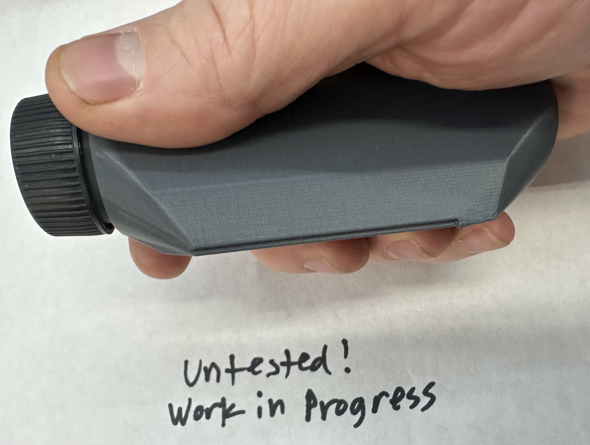
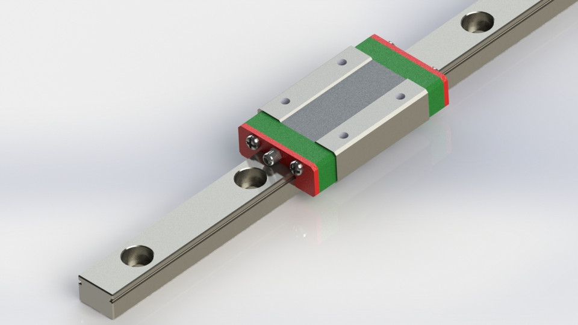
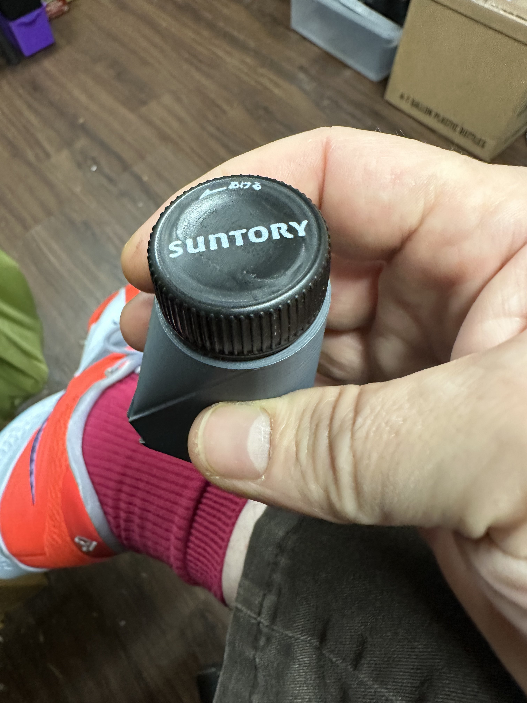
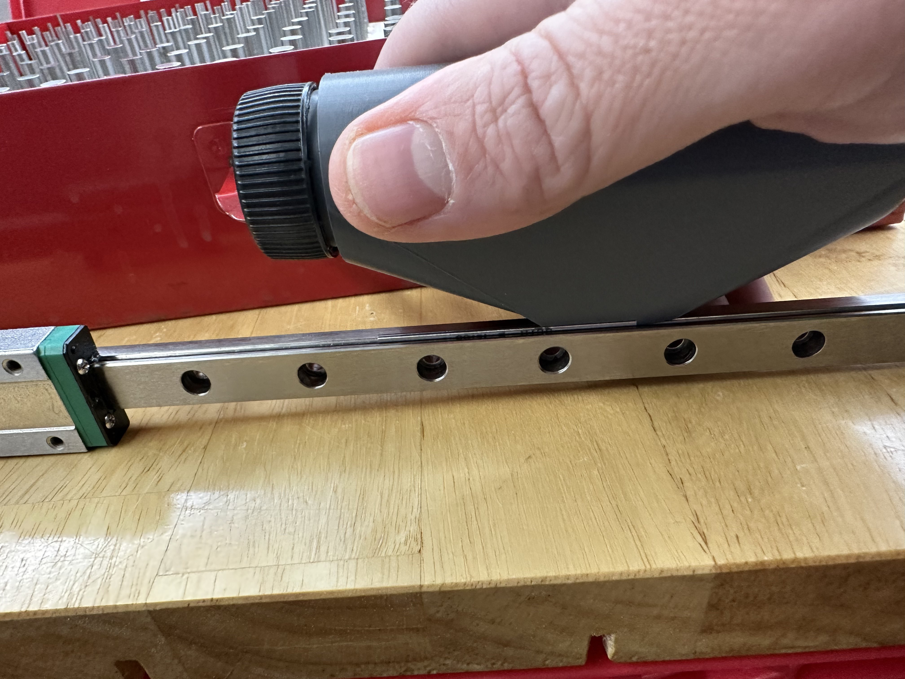

# Coney Island Snowplow

> [!WARNING]  
> Fall 2023: This is currently a work in progress.
> This tool has not been proven to work, (but it probably will).

Coney Island Snowplow - A precision deburring tool for maintaining and repairing any MGN linear motion [bearing rail](https://en.wikipedia.org/wiki/Linear-motion_bearing).

## The Problem This Tool Solves:

MGN rails, commonly used in 3d printers and CNC machines, are key precision components, commonly acquired from a a variety of sources.

**All rails get dings, dents, and scratches which affect their ability to provide precise linear action.**

Even inexpensive $12 rails can be measured to provide *exceptional* linear accuracy, within tolerances of .008mm, over 300mm.  For 3d printing, this is astonishing precision for the price.  Yet, these rails are often cut and handled in ways which can dent and ding the linear ways.  Consider just [the vise which is holding the rails in this video](https://www.youtube.com/watch?v=icKyYg2pjVE&t=303s), it is likely to dent the linear ways.

For 3d printing, these dents can create notable print defects and introudce odd resonance problems.

## Why not just buy high quality rails?

In short, *any* precicision surface will acquire inperfections.

Vendors and manufacturers like [Hiwin](https://www.hiwin.us/) or [Misumi](https://us.misumi-ec.com/) provide linear bearings with exacting quality control, to published and measurable tolerances, but use and handling of thee rails can introduce dings and dents.

Most 3d printers and builders rely on the inexpensive industrial-machine offcut scene, where far less expensive rails can be sourced from [AliExpress](https://www.aliexpress.us/item/2251832643511407.html) and the like.

No matter if your rails exist in a clean-room, or they were cut in some back-alley in the rain, they may acquire imperfections in their precision action.

## Solving the problem

This idea came from Spencer Webb, who produces [PFG Stones®](https://pfg.gg/) for machinsts and precision machine industries.

### How it works:

This tool uses a common "[hardened gage pin](https://www.mcmaster.com/catalog/129/2611/2301A4)", to ride down the bearing ways of a rail, acting like a "snowplow on the road" for any dents or surface deformations.

- The only metal which is cut is anything in the way of the front of the pin.
- The pin must be harder than the rail, (harder things cut softer things).
  - Most rails are hardened steel or stainless, approximately [HRC 40-45](https://en.wikipedia.org/wiki/Rockwell_scale)
  - most common gage pins are [HRC 60-70](https://en.wikipedia.org/wiki/Rockwell_scale)
- The pin must be ground or sharpened with a **precise dead-flat** for the tool to "plow away" the raised imperfections.
- The diameter of the pin should precisely match the diameter of the ball bearings from the bearing assembly, (pin gauges are inexpensive, it's easily within reach to have several pins on hand, to precisely match your ball bearing dimensions).

### How to create your "snowplow pin"

1. Aquire one (or more) gage pins which precisely match the diameter of the ball bearings for your rails
2. create a precision dead-flat grind on one or both ends of your pin

### How to print your "Coney Island Snowplow"

The tool can be 3d printed in any material you commonly print.  Examples in pictures here were printed in ASA, but because this is basically just a handle, you can use PLA, PETG, or ABS, or any other relatively solid filament. (TPU and the like would not work.)

- The print was designed to be printed without supports, with it's butt end on the printbed
- The threaded end was deisgned to accept a common soda bottle cap, so you can easily store your pins inside

### How to use the Tool 

1. Attach a ground pin to the v-groove in the tool (rubber cement or other)
2. Carefully remove the bearing carrage ([Nero 3D has a great how-to video if you've noever done this before](https://www.youtube.com/watch?v=i_F7D4UgkWY))
3. Rub the pin down the rail several times, sliding the precision flat surface of the pin, flush against the rail groove.
 
As you use the tool, Yyu should be able to feel small imperfections as the pin plows into them, and, you should feel them dissappear after sliding the tool several times!

### What it does not do:

1) This tool is not intended to change precision rail geometry, (like most stones or abrasive would).

2) This tool can only be used to make a precision bearing more precise, it *cannot be used to create a precision surface*.  This tool will not straighten bent or twisted rails, nor will it make toast.

3) This toool does not fill in any cuts or nicks in the rail ways, it rides right over them.
